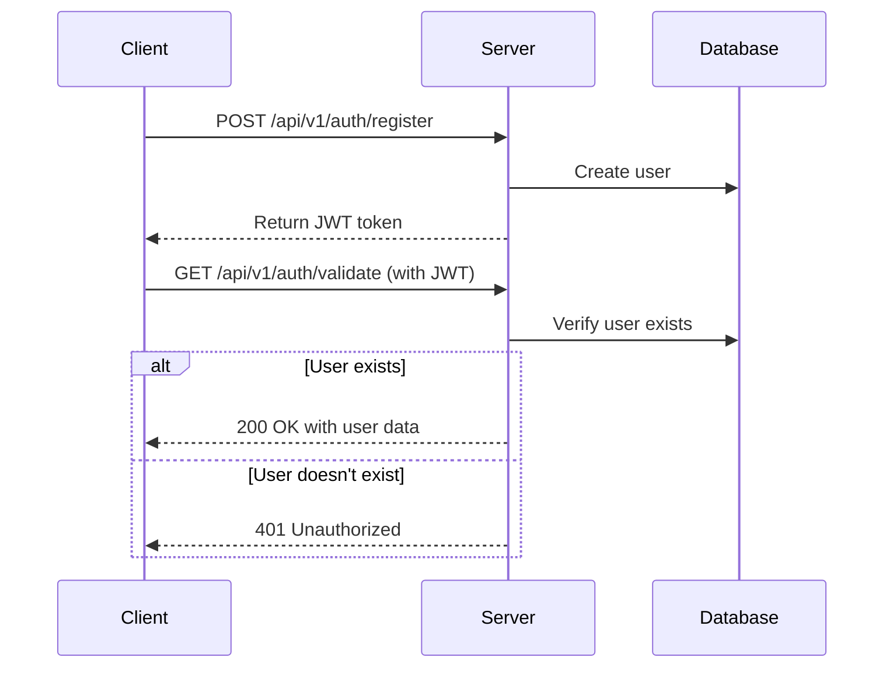

# Authentication System

This document outlines the authentication system for the Tab Sync API, including security considerations, API endpoints, and implementation details.

## Table of Contents
1. [Overview](#overview)
2. [Security Considerations](#security-considerations)
3. [Authentication Flow](#authentication-flow)
4. [API Endpoints](#api-endpoints)
5. [Error Handling](#error-handling)
6. [Best Practices](#best-practices)
7. [Troubleshooting](#troubleshooting)

## Overview

The authentication system uses JSON Web Tokens (JWT) for stateless authentication. Each request to protected endpoints must include a valid JWT in the `Authorization` header.

## Security Considerations

### Why We Don't Auto-Create Users

Auto-creating users based on JWT validation presents several security risks:

1. **Bypasses Business Logic**: User creation typically involves validation, approval workflows, and audit trails that are bypassed with auto-creation.
2. **Security Vulnerabilities**: Compromised tokens could be used to create unauthorized user accounts.
3. **Data Integrity**: Auto-creation can lead to orphaned or inconsistent user accounts.
4. **Compliance Issues**: May violate data protection regulations by creating user records without proper consent.

### Token Security

- Tokens are signed using a strong secret key stored in `JWT_SECRET`.
- Tokens include expiration times to limit their validity period.
- The secret key should be rotated periodically in production environments.

## Authentication Flow



## API Endpoints

### Validate Token

```http
GET /api/v1/auth/validate
Authorization: Bearer <token>
```

#### Successful Response (200 OK)
```json
{
  "valid": true,
  "user": {
    "id": "user-123",
    "name": "John Doe",
    "email": "john@example.com",
    "signupDate": "2025-09-28T22:00:00.000Z",
    "expiresIn": "86399 seconds"
  }
}
```

#### Error Responses

| Status Code | Error Code | Description |
|-------------|------------|-------------|
| 401 | NO_TOKEN | No authentication token provided |
| 401 | INVALID_TOKEN | Token is invalid or malformed |
| 401 | TOKEN_EXPIRED | Token has expired |
| 401 | USER_NOT_FOUND | User does not exist in the system |
| 500 | DATABASE_ERROR | Error accessing user database |

## Error Handling

All error responses follow this format:

```typescript
interface ErrorResponse {
  valid: boolean;
  error: string;
  code: string;
  action?: string;  // Optional guidance for client
}
```

## Best Practices

1. **Client-Side**
   - Store tokens in secure, HTTP-only cookies
   - Implement token refresh logic
   - Handle 401 responses by redirecting to login

2. **Server-Side**
   - Use environment variables for sensitive data
   - Implement rate limiting on authentication endpoints
   - Log authentication attempts and failures
   - Regularly rotate JWT secrets

3. **Database**
   - Index user ID fields for fast lookups
   - Store password hashes, not plaintext passwords
   - Implement account lockout after failed attempts

## Troubleshooting

### Common Issues

1. **401 Unauthorized**
   - Verify token is correctly formatted
   - Check token expiration
   - Ensure user exists in the database

2. **500 Internal Server Error**
   - Check server logs for database connection issues
   - Verify JWT secret is properly configured

### Logging

Authentication-related events are logged with the following structure:
- **Info**: Successful validations
- **Warn**: Failed validations, missing users
- **Error**: System errors, database issues

## Security Notes

1. Never log sensitive information like tokens or passwords
2. Use HTTPS in production
3. Implement proper CORS policies
4. Consider adding IP-based rate limiting
5. Regularly audit authentication logs for suspicious activity
