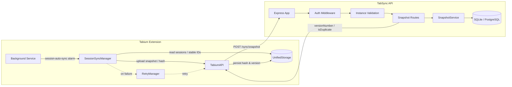
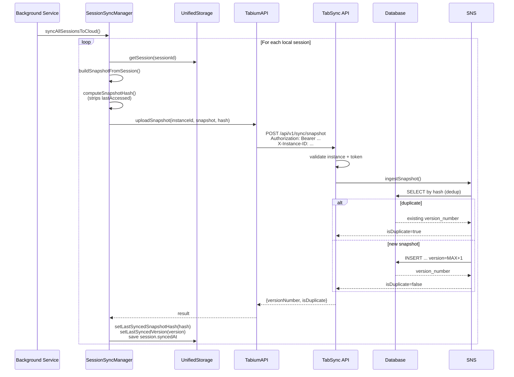

# Tabium Sync Pipeline Architecture

This document describes how browser session state flows from the Tabium extension to the TabSync API and back.

## Components

| Component | Responsibility | Key Files |
|-----------|----------------|-----------|
| **Tabium Background Service** | Registers alarms and dispatches messages | `tab-manager/src/background/TabiumBackgroundService.js` |
| **SessionSyncManager** | Captures browser state, builds snapshots, uploads, retries | `tab-manager/src/background/managers/SessionSyncManager.ts` |
| **TabiumAPI** | HTTP client: auth headers, `X-Instance-ID`, gzip support | `tab-manager/src/api/TabiumAPI.js` |
| **RetryManager** | Circuit-breaker-backed retry queue | `tab-manager/src/background/managers/RetryManager.ts` |
| **UnifiedStorage** | Local IndexedDB/localStorage: sessions, snapshots, stable IDs, sync metadata | `tab-manager/src/storage/UnifiedStorage.ts` |
| **TabSync API** | Express server: auth, instance validation, snapshot/session routes | `tab-sync-api/src/index.ts` |
| **SnapshotService** | Ingestion, deduplication, versioning, timeline, pruning | `tab-sync-api/src/services/SnapshotService.ts` |
| **Database** | SQLite (dev/test) or PostgreSQL (prod) | `tab-sync-api/src/db/*` |

## Data Flow

## Snapshot Lifecycle

## Versioning & Deduplication

1. **Client** computes a SHA-256 hash over the snapshot after stripping volatile fields (`lastAccessed`).
2. **Server** checks `(user_id, instance_id, snapshot_hash)` for an existing row.
   * If found, returns the existing `version_number` with `isDuplicate: true`.
   * If not, it atomically assigns `version_number = MAX(existing) + 1` for that `(user_id, instance_id)` and inserts the new snapshot.
3. **Retry**: if the atomic insert collides on the unique `(user_id, instance_id, version_number)` constraint, the service retries up to 3 times.

## Retention & Pruning

The server applies a tiered retention policy (`src/services/SnapshotService.ts`):

| Age | Kept |
|-----|------|
| < 48h | all snapshots |
| 48h – 7d | one per hour |
| 7d – 30d | one per day |
| 30d – 90d | one per week |
| > 90d | one per month |

Pruning is triggered by `POST /api/v1/sync/snapshot/:instanceId/prune`.

## Key Design Decisions

* **Stable IDs**: Chrome tab/window IDs are transient across restarts. The extension maps each transient ID to a persisted `crypto.randomUUID()` stable ID stored in `UnifiedStorage`.
* **Instance ID**: A UUID generated once per extension installation and sent in the `X-Instance-ID` header. The server scopes snapshots and sessions by `(user_id, instance_id)`.
* **JWT + DB token**: The server validates the JWT signature and then verifies the token still matches the `users.token` column, allowing login/password changes to revoke older tokens.
* **Gzip uploads**: The client may compress the snapshot and send it as a `Blob` with `Content-Encoding: gzip`.
